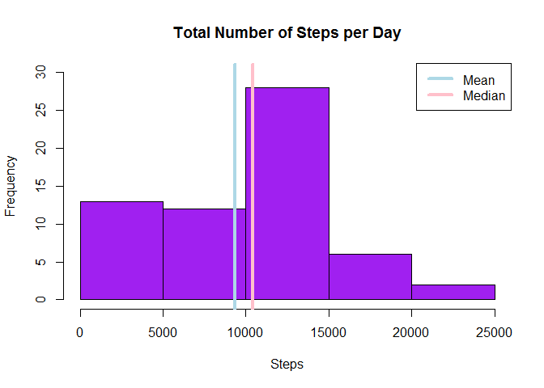
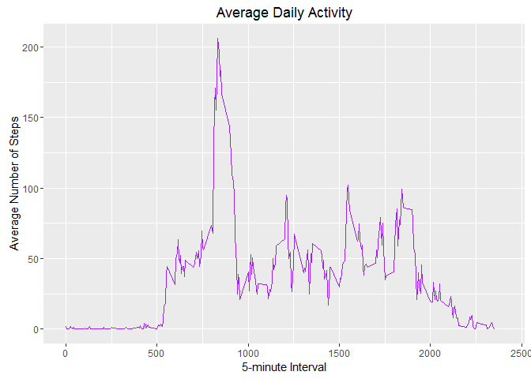
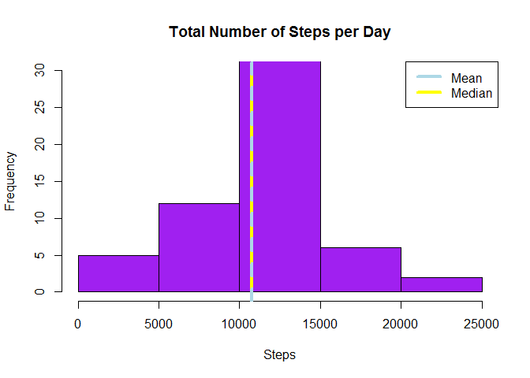
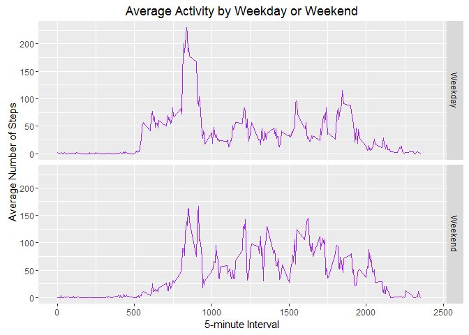

**Reproducible Research Assignment 1**
=====================================

###**Loading and processing the data**


```r
activity <- read.csv("C:/Users/vgw52064/Desktop/Coursera/Reproducible Research/activity.csv")
str(activity)
```

```
## 'data.frame':	17568 obs. of  3 variables:
##  $ steps   : int  NA NA NA NA NA NA NA NA NA NA ...
##  $ date    : Factor w/ 61 levels "2012-10-01","2012-10-02",..: 1 1 1 1 1 1 1 1 1 1 ...
##  $ interval: int  0 5 10 15 20 25 30 35 40 45 ...
```

```r
summary(activity)
```

```
##      steps                date          interval     
##  Min.   :  0.00   2012-10-01:  288   Min.   :   0.0  
##  1st Qu.:  0.00   2012-10-02:  288   1st Qu.: 588.8  
##  Median :  0.00   2012-10-03:  288   Median :1177.5  
##  Mean   : 37.38   2012-10-04:  288   Mean   :1177.5  
##  3rd Qu.: 12.00   2012-10-05:  288   3rd Qu.:1766.2  
##  Max.   :806.00   2012-10-06:  288   Max.   :2355.0  
##  NA's   :2304     (Other)   :15840
```

###**What is the mean of the total number of steps taken per day?**

First, total number of steps is calculated.


```r
totalsteps <- tapply(activity$steps, activity$date, FUN = sum, na.rm = TRUE)
summary(totalsteps)
```

```
##    Min. 1st Qu.  Median    Mean 3rd Qu.    Max. 
##       0    6778   10400    9354   12810   21190
```

Additionally, the mean and median values of the total steps taken per day is calculated
and formatted.
Lastly, a histogram of the total steps taken per day is generated.


```r
totalstepsMean <- mean(totalsteps)
Mean <- format(totalstepsMean, big.mark = ",", nsmall = 2)
totalstepsMed <- median(totalsteps)
Median <- format(totalstepsMed, big.mark = ",", nsmall = 2)

hist(totalsteps, ylim= c(0,30), main = "Total Number of Steps per Day", 
          xlab = "Steps", col = "purple")
     abline(v=totalstepsMed, col="pink", lwd=4)
     abline(v=totalstepsMean, col="lightblue", lwd=4)
     legend(x="topright", legend = c("Mean", "Median"), col = c("lightblue", "pink"), lwd = 4)
```




The mean of the total number of steps taken per day is **9,354.23** and shown in blue in the graph.


The median of the toal number of steps taken per day is **10,395** and shown in pink in the graph.

###**What is the average daily activity pattern?**

First, the average number of steps taken per 5-minute intervals is determined.
A time series plot is generated and the maximum value is extracted.


```r
library(ggplot2)
```

```
## Warning: package 'ggplot2' was built under R version 3.2.5
```

```r
avgint <- aggregate(x=list(steps = activity$steps), by =list(interval = activity$interval),
                    FUN = mean, na.rm=TRUE)

ggplot(data = avgint, aes(x=interval, y=steps)) + geom_line(color="purple") + xlab("5-minute Interval") + 
          xlim(c(0,2400)) + ylab("Average Number of Steps") + ggtitle("Average Daily Activity")
```



```r
avgint[which.max(avgint$steps),]
```

```
##     interval    steps
## 104      835 206.1698
```


The **835th** 5-minute interval contains the maximum average number of steps at a total of **206** steps. 


###**Missing Values**

The presence of missing days may introduce bias into some calculations or summaries of the data.


```r
sum(is.na(activity))
```

```
## [1] 2304
```

Currently, there are **2,304** days/intervals where there are missing values (coded as NA) in the dataset. 

Missing values will be substituted by the mean value for that 5-minute interval and a new dataset with **no** missing values is created.


```r
average <- tapply(activity$steps, activity$interval, mean, na.rm=T)
filled <- transform(activity, steps=ifelse(is.na(steps), average, steps))
summary(filled)
```

```
##      steps                date          interval     
##  Min.   :  0.00   2012-10-01:  288   Min.   :   0.0  
##  1st Qu.:  0.00   2012-10-02:  288   1st Qu.: 588.8  
##  Median :  0.00   2012-10-03:  288   Median :1177.5  
##  Mean   : 37.38   2012-10-04:  288   Mean   :1177.5  
##  3rd Qu.: 27.00   2012-10-05:  288   3rd Qu.:1766.2  
##  Max.   :806.00   2012-10-06:  288   Max.   :2355.0  
##                   (Other)   :15840
```

```r
sum(is.na(filled))
```

```
## [1] 0
```

Total number of steps for the new dataset with no missing values is calculated.


```r
totalsteps.filled <- tapply(filled$steps, filled$date, FUN = sum)
summary(totalsteps.filled)
```

```
##    Min. 1st Qu.  Median    Mean 3rd Qu.    Max. 
##      41    9819   10770   10770   12810   21190
```

Additionally, the mean and median values of the total steps taken per day is calculated
and formatted for the new dataset.
Lastly, a histogram of the total steps taken per day is generated for the new dataset.


```r
totalstepsMean.filled <- mean(totalsteps.filled)
Mean.filled <- format(totalstepsMean.filled, big.mark = ",", nsmall = 2)
totalstepsMed.filled <- median(totalsteps.filled)
Median.filled <- format(totalstepsMed.filled, big.mark = ",", nsmall = 2)

hist(totalsteps.filled, ylim= c(0,30), main = "Total Number of Steps per Day", xlab = "Steps", col = "purple")
     abline(v=totalstepsMed.filled, col="yellow", lwd=4)
     abline(v=totalstepsMean.filled, col="lightblue", lwd=4, lty=2)
     legend(x="topright", legend = c("Mean", "Median"), col = c("lightblue", "yellow"), lwd = 4)
```




The mean of the total number of steps taken per day is **10,766.19** and shown in blue in the graph.


The median of the toal number of steps taken per day is **10,766.19** and shown in pink in the graph.


Now that no NA values are present in the data, the mean and median are equal.

###**Differences in activity patterns between weekdays and weekends**

New factor variables are created "weekday" and "weekend" indicating whether a given date is a weekday or weekend day.
This data is then appended onto the dataset containing no NA values.


```r
days <- function(date){
     day <- weekdays(date)
     if(day %in% c("Monday", "Tuesday", "Wednesday", "Thursday", "Friday"))
          return("Weekday") else if (day %in% c("Saturday", "Sunday"))
          return("Weekend") else stop("invalid date")
}
filled$date <- as.Date(filled$date)
filled$day <- sapply(filled$date, FUN= days)
```

Panel plot on the average number of steps taken on weekdays and weekends is shown below:


```r
library(ggplot2)
dayavg <- aggregate(steps~interval + day, data = filled, mean)

ggplot(data = dayavg, aes(x=interval, y=steps)) + geom_line(color="purple") + facet_grid(day ~.) +
          xlab("5-minute Interval") + xlim(c(0,2400)) + ylab("Average Number of Steps") + 
          ggtitle("Average Activity by Weekday or Weekend")
```



```r
dayavg[which.max(dayavg$steps),]
```

```
##     interval     day    steps
## 104      835 Weekday 230.3782
```

The maximum average number of steps still occurs at the **835th** 5-minute interval, 
it is classified as a **weekday** and at a total of **230** steps. 
